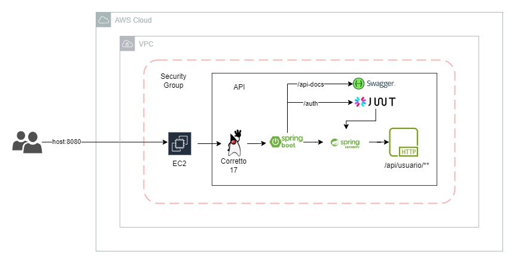

# API Básica de Finanças

Este projeto é uma API básica de finanças desenvolvida como parte de um desafio. Ela permite gerenciar transações financeiras, autenticar usuários e documentar a API usando o Spring Boot.

## Tecnologias Utilizadas

- **Spring Boot**: Framework Java para desenvolvimento rápido de aplicações.
- **Spring Security**: Para autenticação e autorização.
- **JWT (JSON Web Token)**: Para autenticação baseada em tokens.
- **Swagger**: Para documentação da API.

## Implantação na AWS

Este projeto já está implantado em uma instância EC2 na AWS. Você pode acessar a API através do IP público da instância na porta 8080.
:
## Funcionalidades

1. **Autenticação e Autorização**:
    - A API suporta autenticação via JWT.
    - Usuários podem se registrar, fazer login e obter um token JWT válido.
    - As rotas são protegidas por autenticação.

2. **Gerenciamento de Transações**:
    - Os usuários podem criar, listar e excluir "transações financeiras".

## Configuração

1. **Clonando o Repositório**:

git clone https://github.com/Marcos-Santoss2/desafio-itau-jr.git

2. **Configurando o Banco de Dados**:
- Configure as propriedades do banco de dados no arquivo `application.properties`.
- Execute as migrações do banco de dados.

3. **Executando a Aplicação**:

./mvnw spring-boot:run

4. **Acessando a Documentação da API**:
- Acesse http://localhost:8080/swagger-ui/index.html#/ para visualizar a documentação gerada pelo Swagger.

## Exemplo de Uso

1. **Registro de Usuário**:
- Envie uma requisição POST para `/auth` com os dados do usuário.
- Receba um token JWT como resposta.

2. **Criando Objetivos Futuros**:
- Envie uma requisição POST para `/api/usuario/{login}/desejos/adicionar` com os detalhes do objetivo.
- Inclua o token JWT no cabeçalho da requisição.

4. **Listando Usuarios**:
- Envie uma requisição GET para `/api/usuario/listar`.
- Inclua o token JWT no cabeçalho da requisição.

## Contribuição

Primeiramente, gostaria de agradecer por me proporcionar a oportunidade de trabalhar neste desafio. Foi uma experiência enriquecedora e estou ciente de que sempre há espaço para melhorias na API.

Estou à disposição para qualquer feedback, sugestão ou colaboração adicional.

Muito obrigado pela confiança e pela oportunidade de contribuir para o seu projeto. 😊

---
